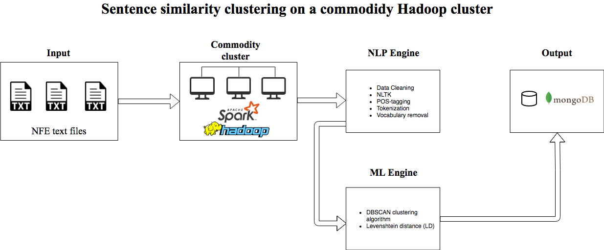

## **Agrupamento de sentenças similares em cluster de baixo custo**

#### Aplicar técnicas de manipulação e aprendizado de máquina em grande massas de dados está se tornando uma tarefa muito promissora, considerando-se que dados “escondidos” podem revelar padrões valiosos para uma organização. A clusterização visa encontrar um padrão em uma massa de dados. Clientes que têm o mesmo perfil de compra, usuários que têm o gosto musical semelhante, etc. O agrupamento é capaz de encontrar essas relações, baseada em uma distância de similaridade, sendo extremamente relevante, principalmente quando não se conhece a massa de dados.

#### Neste projeto foram aplicadas técnicas de limpeza e manipulação de dados, técnicas de Processamento de Linguagem Natural (PLN) e Aprendizado de Máquina (AM) para agrupar produtos similares dentro de uma extensa massa de dados.

#### Para viabilizar o processamento de uma grande massa de dados de itens de Notas Fiscais, foi necessário a criação de um cluster de baixo custo (com máquinas comuns) e a adaptação do código para executar o processamento em paralelo. Para o processamento de grande massa de dados e gerenciamento do cluster, foram utilizadas as ferramentas Apache Hadoop (https://hadoop.apache.org/) e Apache Spark (https://spark.apache.org/).

## **Objetivos**
- Dada uma massa de dados e um item de pesquisa, realizar uma consulta dentro dessa massa de dados, ordenando o resultado por relevância;
- Utilizar técnicas de Processamento de Linguagem Natural aplicadas à massa de dados com o intuito de identificar itens que estejam associados ao resultados, mas descritos de formas diferentes;
- Baseado na massa de dados, realizar o agrupamento de itens similares sintaticamente;

## **Metodologia**

#### Para processar dados textuais em larga escala, fazer o tratamento do texto, agrupar dados similar e persistir o resultado, projeto foi dividido em várias etapas. O diagrama abaixo apresenta cada componente da arquitetura adotada e suas responsabilidades

    

 

### **Entrada**
#### Nessa etapa, a massa de dados foi coletada para, em uma etapa subsequente, ser processada. A massa total de dados compreendia cerca de 56 arquivos de texto, com aproximadamente 1 milhão de produtos cada, totalizando ~56 milhões de produtos. Cada arquivo de texto possuía produtos oriundos de arquivos de Notas Fiscais Eletrônicas. 

#### Em um primeiro momento, o trabalho foi feito com uma carga reduzida de arquivos, começando por 1 até 10. Na primeira iteração, conseguimos um tempo superior a 20 minutos para aplicar as técnicas de PLN para cada arquivo, somando cerca de 20 horas para a limpeza de todos os registros. 

#### Claramente estávamos tendo um problema de performance e precisávamos melhorar. 

### **Cluster de baixo custo**

#### O tempo superior a 20 minutos por arquivo era excessivo e inviável para o projeto. Levando isso em consideração, precisávamos otimizar esse processamento com o poder de processamento limitado que tínhamos (cerca de 5 notebooks com processador Core i3, 4GB de memória RAM e HDD).

#### A performance do algoritmo precisava ser repensada. Considerando isso, adaptamos o nosso código em python para utilizar frameworks de processamento paralelo para atingir a melhoria necessária. Para isso, utilizando o Apache Hadoop, criamos um cluster de baixo custo com as 5 máquinas supracitadas, totalizando mais de 10GB de memória utilizável e combinando o poder de processamento. Posteriormente, implementamos o algoritmo de limpeza dos arquivos usando o framework Apache Spark. Ne seção de resultados desse artigo iremos discutir sobre as melhorias alcançadas no projeto ao aplicar os ajustes mencionados nessa seção.

#### Finalmente, com os arquivos limpos, alimentávamos o algoritmo de aprendizado de máquina. 

### **Motor de Processamento de Linguagem Natural** 

#### Nessa etapa, utilizamos técnicas de PLN para limpar, remover palavras desnecessárias e tokenizar cada linha do arquivo lido. Posteriormente, esses dados eram enviados para alimentar o modelo de aprendizado de máquina.

### **Motor de Aprendizado de Máquina**

#### Nessa etapa, utilizamos um algoritmo de aprendizado não supervisionado (clustering) para criar agrupamentos entre produtos similares sintaticamente. A ideia era aplicar a distância de Levenshtein para calcular a similaridade entre termos. Termos com similaridade acima de 0.70 eram alocados no mesmo grupo. Adicionalmente, o algoritmo de clusterização utilizado foi o DBSCAN, por questões de performance e por ter a característica de remover outliers.
 
### **Saída**

#### Por fim, a saída gerada pelo algoritmo era persistida em uma base de dados noSQL no MongoDB para análise posterior. Cada cluster possuía a sua lista de produtos similares que, posteriormente, poderíam ser, por exemplo, renomeados para um nome em comum.

## **Resultados**

#### Elaborando um pouco mais sobre as melhorias implementadas nesse projeto, ao final da adaptação do código para o processamento distribuído, conseguimos uma melhoria superior a 90% no tempo de limpeza de cada arquivo. Além disso, todo do processo, da entrada dos dados até a saída para persistência, foi concluído de forma mais rápida do que todo o tempo utulizado pela limpeza dos arquivos antes do projeto estar utilizando frameworks de processamento distribuído. 

## **Habilidades aplicadas**

#### Clustering (Unsupervised Learning), DBSCAN, MongoDB, Spark, Hadoop, Parallel computing, NLP

## Observações

#### Por se tratar de uma pesquisa comercial, irei disponibilizar o código parcialmente. O trecho de código disponibilizado é utilizado para a ingestão de grande massa de dados e aplicação de técnicas de PLN para limpeza e transformação dos arquivos de texto. Trecho do código utilizado nessa pesquisa pode ser encontrado no endereço: https://tinyurl.com/yazdxth4.