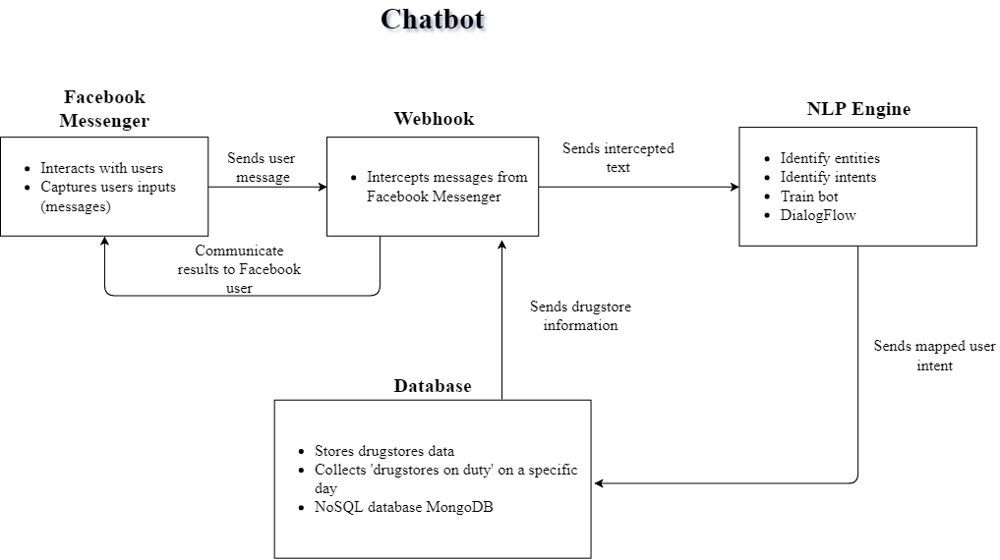
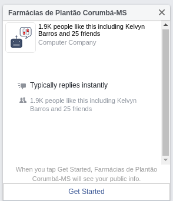
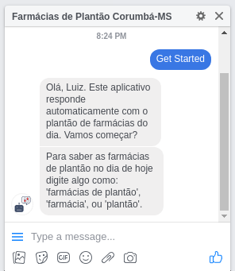
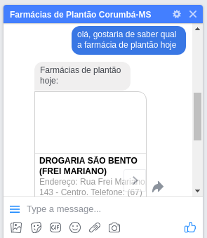
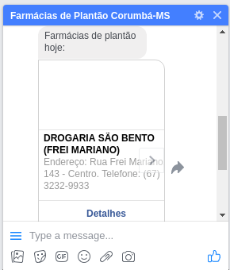
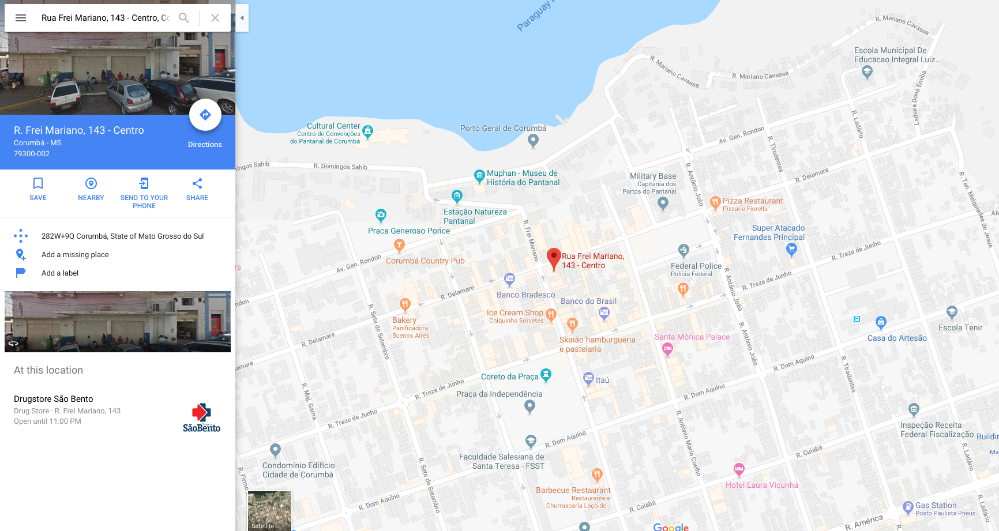
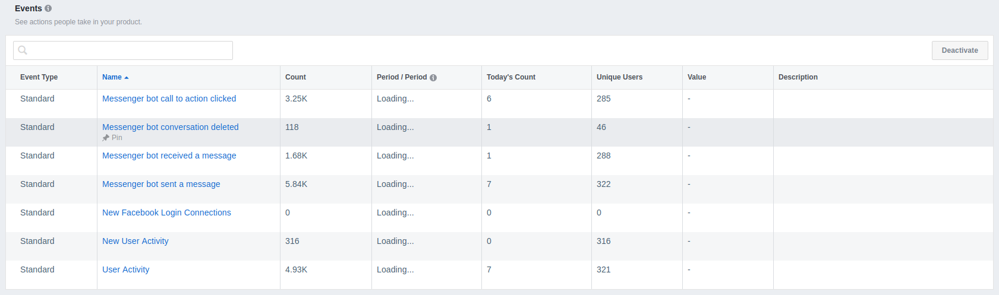

## **Chatbot "Farmácias de Plantão"**

Muitas cidades no Brasil utilizam o sistema de plantão de farmácias, garantindo que um serviço essencial à população não seja interrompido. Entretanto, em cidades como Corumbá-MS, a divulgação de informações sobre quais farmácias estão de plantão em um dia específico não é feita de forma clara e de fácil acesso. Portanto, este trabalho visa apresentar uma solução digital através de um chatbot para Facebook Messenger, permitindo aos usuários descobrir quais são as farmácias de plantão através de uma interface que lhe é comum: uma janela de chat.

## **Motivação**
Algumas cidades, como Corumbá-MS, por exemplo, dispõem somente de maneira manual - através de banners ou placas indicativas - a informação quais farmácias estão de plantão em determinado dia. Entretanto, muitas vezes é preciso percorrer um longo caminho até a farmácia mais próxima para ter acesso a tal informação. Eventualmente, essas informações estão inconsistentes e desatualizadas, levando a população a falsas conclusões. Muitas publicações foram notadas através de redes sociais a respeito de usuários solicitando informações sobre os estabelecimentos que estão de plantão durante diversos dias. 

A forma manual com que as tarefas são executadas pode levar a dados inconsistentes e/ou desatualizados. Além disso, as pessoas devem desempenhar uma espécie de investigação a fim de encontrar a informação que desejam: a farmácia de plantão. Isso se deve pelo fato de, as vezes, várias farmácias estarem divulgando informações divergentes umas das outras, logo, dificultando a tomada de decisão. Para qual farmácia devo me deslocar?

Na era digital, essas tarefas rotineiras podem ser substituídas por sistemas e aplicações que, de forma eficiente e a baixo custo, podem solucionar diversos problemas. Neste trabalho propomos uma aplicação de chatbot para informar aos usuários sobre as farmácias de plantão na cidade de Corumbá-MS. 

## **Introdução**
Com a quantidade de dados disponível na era digital, criaram-se inúmeras possibilidades de aplicações utilizando dados para a tomada de decisão e para resolver problemas do cotidiano de uma forma antes não imaginada. Com o advento dos smartphones na década de 2000, aplicativos se tornaram muito relevantes para resolver tarefas que os usuários demandam. Entretanto, uma infinidade de aplicativos foi criada, tornando muitos subutilizados ou que, simplesmente, não cumprem o esperado. 

Os chatbots surgem com o intuito de agregar valor a um projeto, seja de um empresa de comércio à uma rede bancária. Os chatbots são um serviço onde pessoas podem interagir através de uma linguagem natural, como Português ou Inglês, e suas intenções são identificadas por um sistema em execução, interpretadas, e uma saída é gerada ao usuário como resposta. Estas aplicações servem para um propósito específico, como responder perguntas, executar uma ação, agendar uma consulta, e não devem executar muitas tarefas. Além disso, os chatbots ficam disponíveis vinte e quatro horas por dia e, geralmente, conseguem executar tarefas de forma eficiente, dispensando a intervenção humana.

A utilização destas aplicações vem se tornando cada vez mais comuns, especialmente em aplicativos de mensagens instantâneas (chats) muito populares, como Facebook Messenger, que é o escopo deste projeto. Empresas têm utilizado esta tecnologia para facilitar o acesso do usuário, responder dúvidas comuns, além de executar tarefas simples e rotineiras. Embora os bots possam desempenhar muitas funções, eles têm limitações e seu objetivo não é substituir os humanos, e sim auxiliá-los em suas tarefas.

Em algumas cidades do Brasil é comum que as redes farmacêuticas não funcionem vinte e quatro horas por dia, e sim em um horário estabelecido. Por isso, um sistema de plantão através de rodízio é implementado, onde em cada dia do mês, uma ou mais farmácias estarão funcionando de plantão, atendendo à população. Em muitas cidades, a publicação destas farmácias sorteadas é feita de forma manual. Entretanto, esta forma obsoleta de interação - na era digital - é ineficiente e causa, muitas vezes, transtornos aos usuários, especialmente em cidades que possuem  muitas farmácias. No mesmo sentido, é possível que a indicação de qual farmácia esteja de plantão seja mal interpretada ou não seja íntegra, uma vez que deve ser feita manualmente e diariamente por todas as farmácias participantes do rodízio. 
	
Pensando nesse problema apresentado, este projeto visa o desenvolvimento de uma aplicação de chatbot para informar os usuários quais as farmácias de plantão do dia atual. Desta forma, as pessoas teriam acesso a uma informação atual e precisa, de uma forma que já estão acostumadas: através de um chat. 

## **Objetivos**
Este projeto tem como objetivo desenvolver um aplicativo de conversa (chatbot) para interagir com usuários através do Facebook Messenger e ajudá-los na tarefa de encontrar farmácias de plantão. São objetivos deste trabalho:

- Desenvolver aplicação para Facebook Messenger
- Atender à população de Corumbá, Mato Grosso do Sul, em um primeiro momento
- Atualizar a base de dados com as farmácias de plantão mensalmente
- Tornas as iterações mais curtas - simples - possíveis
- Apresentar informações sobre as farmácias de plantão, como endereço, telefone e uma mapa interativo com as coordenadas, - caso o usuário não saiba como chegar

## **Metodologia**

Para que o usuário final tenha acesso à informação de farmácias de plantão, alguns mecanismos foram implementados em conjunto, formando uma simples arquitetura de envio e recebimento de dados. Os componentes dessa arquitetura e suas responsabilidades são detalhados no diagrama abaixo.

    

 

### **Facebook Messenger**

O Facebook messenger foi a plataforma escolhida para a criação do chatbot. Por ser uma plataforma amplamente utilizada e por perceber que era comum usuários desta rede questionarem informações sobre farmácias, o Messenger se tornou a opção ideal para nosso projeto.

A API do Facebook é responsável por capturar as mensagens dos usuários e retornar uma resposta, a resposta sendo digitada por um humano ou bot de conversa. Capturada essa mensagem, podemos fazer o processamento da mesma e interceptar a conversa.

### **Webhook**

O webhook é o componente responsável por interceptar a mensagem enviada pelo usuário, possibilitando o tratamento da mesma por uma API de PLN, por exemplo. Com a interação iniciada, podemos enviar a mensagem para nosso motor de Processamento de Linguagem Natural.

### **Motor de Processamento de Linguagem Natural**

O processamento da mensagem é feito através de técnicas de Processamento de Linguagem Natural e a ferramenta Dialogflow (https://dialogflow.com/) foi utilizada. Esse framework é responsável por identificar elementos-chave em uma conversa real e efetuar algum processamento no backend da aplicação. No caso desse projeto, os seguintes recursos da ferramenta foram utilizados:

- `entities`: permite definir as <strong>entidades</strong> da aplicação. Essas entidades irão servir para que o modelo de PLN consiga identificar esses elementos na interação com o usuário, independente da forma como o usuário digitar uma mensagem. No caso desse projeto, como o conceito mais importante é a farmácia, obviamente <strong>farmácia</strong> é a nossa entidade;
- `intents`: intents definem <strong>intenções</strong> do usuário final, ou seja, o que o usuário deseja com a sua mensagem. Esse recurso nos permite treinar o modelo de PLN com algumas entradas de texto padrão, simulando um usuário real;
- `training`: é natural pensar que o chatbot vai falhar eventualmente. Ou seja, as vezes o bot não irá conseguir identificar o que o usuário está tentando dizer. Para isso, o Dialogflow permite treinarmos o nosso bot para que possamos, cada vez mais, aprimorá-lo. Para isso, podemos manualmente corrigir algumas mensagens que o bot falhou em reconhecer, para que, no futuro, ao se deparar com o mesmo cenário, o chatbot tenha uma alternativa e uma resposta válida.

### **Base de dados**

Após identificar que a intenção (`intent`) do usuário é saber qual é a farmácia de plantão no dia atual em que ele está interagindo com a ferramenta, precisamos de algum mecanismo backend para recuperar as informações das farmácias de plantão. Para essa tarefa, selecionamos o banco de dados noSQL MongoDB para persistir os dados das farmácias. Ao usuário fazer a interação com o bot, o webhook irá interceptar essa conversa e fazer uma chamada ao serviço backend para coletar as informações que o usuário deseja saber. Posteriormente, os dados são retornados e a aplicação de chat será responsável por exibir esses dados para o usuário.

### **Demonstração**

Nesta seção iremos demonstrar a utilização do aplicativo. Nota-se que, com apenas uma mensagem, o usuário consegue acesso à informação desejada. O aplicativo de chat pode ser acessado através desse endereço: https://www.facebook.com/farmaciasplantao/.

Ao abrir o chat pela primeira vez, o mesmo irá aprentar um botão para iniciar a conversa. A figura abaixo ilustra a primeira interação do usuário com o bot.

    

 

Ao clicar em "Iniciar" (ou "Get Started", se o seu idioma estiver configurado para o Inglês no Facebook), o bot irá saudar o usuário (pelo seu primeiro nome) e explicar o objetivo do bot e sua utilização mais básica, como mostrado na figura abaixo.

    

 

Feita a introdução do bot, é a hora do usuário interagir. Qualquer mensagem que contenha a entidade 'farmácia' será identificada pelo mecanismo de PLN. Com a utilização da ferramenta, foram aplicadas melhorias (treinamento) para que o bot identifique diversas outras formas de escrever a mesma mensagem, até mesmo com erros gramaticais. A figura abaixo ilustra um exemplo de interação com o bot.

    

 

Após enviar a solicitação ao bot, após alguns segundos o mesmo retorna com a mensagem informando as farmácias de plantão no dia atual. É comum que mais de uma farmácia esteja de plantão no mesmo dia (no mínimo duas) e, por esse motivo, o chatbot apresenta um componente de lista para comportar a lista de farmácias. Além disso, para cada farmácia, o bot possui informações detalhadas sobre ela (como endereço e telefone) e um botão 'Como chegar' que invoca a aplicação de mapas do smartphone ou abre o Google Maps no navegador para exibir a farmácia desejada no mapa.

    

 

Ao clicar na farmácia desejada, a mesma é exibida no mapa para agir a localização da mesma, especialmente se o usuário não tiver familiaridade com a cidade. 

    

 

### **Indicadores**

Alguns indicadores foram extraídos da plataforma de analytics do Facebook. A tabela abaixo apresenta um resumo dos números de interações do bot durante o seu período de operação.

    

 

Na tabela de dados de eventos recebidos pelo bot, podemos notar, por exemplo que o bot recebeu **1,680** mensagens e enviou **5,840**. Adicionamente, podemos ver que o botão de enviar mensagem para o bot foi acionado **3,250** vezes.