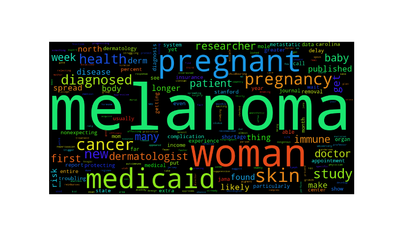
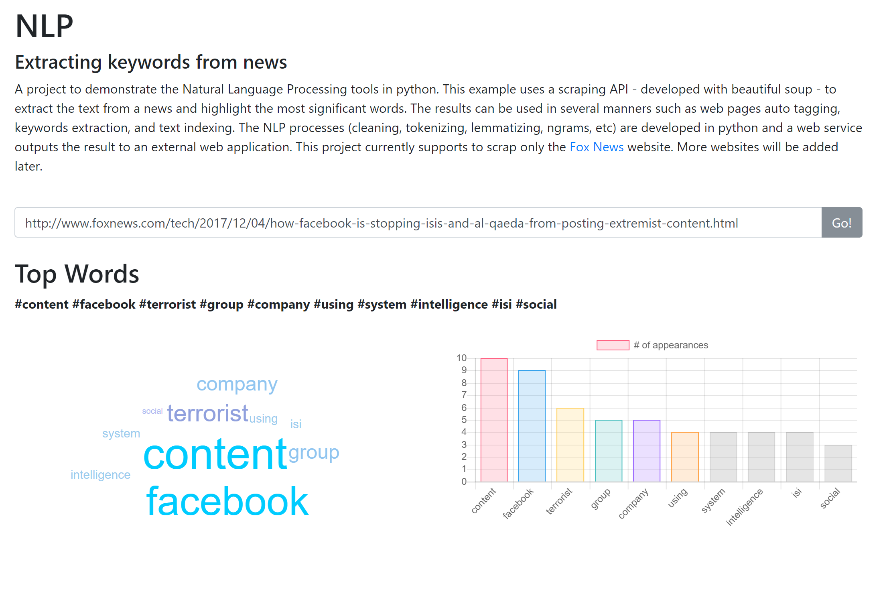

# <strong>Extraíndo palavras-chave de artigos de notícia</strong>

#### Este projeto visa demonstrar a utilização do Processamento de Linguagem Natural (NLP) para extração e palavras-chave de artigos de notícias de temas diversos. Nesse exemplo, iremos apresentar um projeto completo, que envolve diversas etapas de Data Science e Machine Learning, como: coleta de dados, limpeza e tratamento do texto e criação de uma interface de comunição entre a engine de PLN com aplicações externas.

    

 

## <strong>Metodologia</strong>
#### O diagrama apresentado abaixo explica o fluxo tratado nesse projeto e a responsabilidade de cada componente dentro do mesmo.

 
    

 

### <strong>Web app</strong>
#### A porta de entrada dessa ferramenta é uma aplicação web que interage com o usuário e recebe a entrada do mesmo. Essa entrada deverá ser o endereço de um artigo de notícia válido. Neste primeiro momento, somente links do site Fox News (https://www.foxnews.com/) são aceitos, uma vez que o motor de scrapping que faz a coleta dos dados só foi programado para a estrutura de páginas deste site. A próxima etapa é enviar os dados do coletados do artigo desejado e passá-los ao webservice. Por fim, a aplicação web irá apresentar ao usuário final os resultados retornados do motor de PLN. A figura abaixo ilustra a aplicação web de demonstração.

    

 

### <strong>Webservice</strong>

#### A comunicação entre a aplicação web demo e o motor de PLN será responsabilidade de um webservice RESTful. Esse webservice irá enviar a URL informada para a notícia desejada e fazer uma chamada ao mecanismo de raspagem de dados. O webservice pode ser encontrado neste endereço: https://tinyurl.com/ybnpfaqd.

### <strong>Python scrapping</strong>

#### O mecanismo de raspagem de dados irá receber o endereço URL informado pelo usuário da aplicação web e, posteriormente, irá "raspar" a página do artigo de notícia para coletar os dados de texto puro presentes na mesma. Esse motor foi implementado utilizando a biblioteca Beautiful Soap (https://tinyurl.com/ycqvo6zu) e atualmente tem a capacidade de raspar dados do site de notícia Fox News.

#### Feita a coleta dos dados, o scrapping irá alimentar o o motor de PLN com o texto completo do artigo.

### <strong>NLP Engine</strong>

#### Por fim, será responsabilidade do motor de PLN receber o texto puro - coletado pelo scrapping - e aplicar técnicas de PLN. Algumas das técnicas utilizadas envolvem:

1. **Text cleaning:** Nessa etapa, iremos aplicar técnicas para remover palavras que não agregam significado à análise,
    como: remoção de `stopwords` e remoção de palavras em vocabulário de itens em 'lista negra', que são consideradas as
    palavras que são muito comuns em artigos de notícia;
2. **Text normalization:** Nesta tarefa, o motor PLN irá aplicar as técnicas de `stemming`, `n-grams`, `lemmatization` e remover palavras que 
    possuem tags específicas que não agream significado à análise. Essas técnicas são aplicadas visando melhorar os resultados 
    do nosso modelo, removendo palavras desnecessárias e tentando ao máximo identificar as diversas variações da linguagem;
3. **Most common terms:** Por fim, após a limpeza e normalização dos dados, iremos identificar os termos de maior relevância no 
    artigo de notícias informado pelo usuário.
    
#### Feita a extração dos termos relevantes, o motor de Processamento de Linguagem Natural irá retornar o resultado ao webservice que faz a comunicação entre as pontas. Por fim, o webservice irá retornar esses valores à aplicação web que o invocou e, consequentemente, mostrar ao usuário final de forma intuitiva. O código do projeto pode ser encontrado nesse endereço: https://tinyurl.com/yb5792vq.

## Habilidades aplicadas
#### Web scrapping, NLP, Webservices, Web Development, Data Representation and Visualization