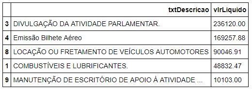
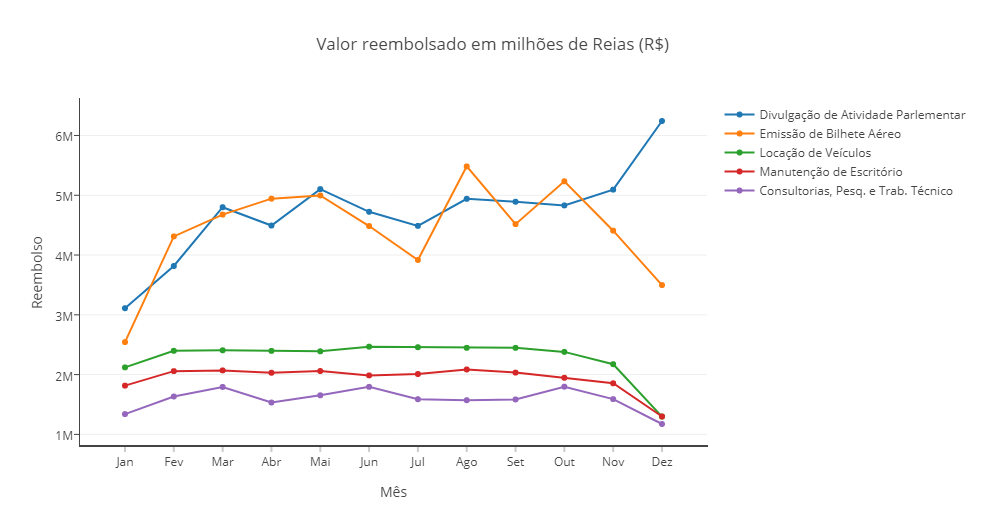
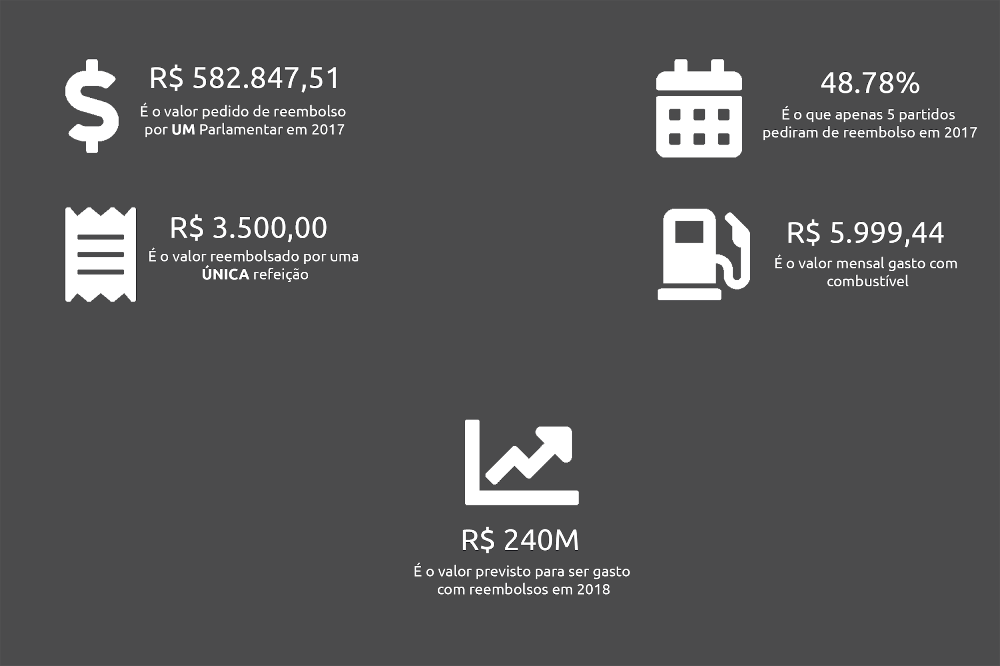
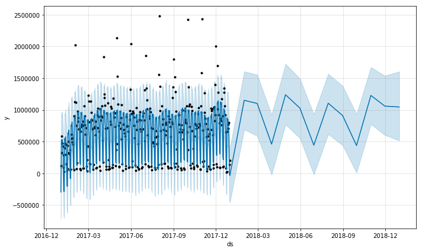
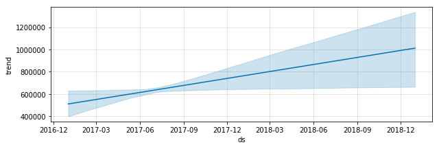
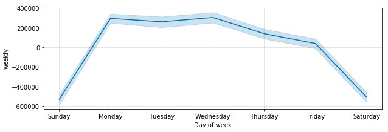

## Análise e visualização de dados abertos

A era digital tem criado muitas oportunidades de negócios. Estima-se que 90% de todos os dados disponíveis hoje foram gerados nos últimos 2 anos. Usuários geram dados a todo momento e empresas que conseguem extrair valor dos mesmos possuem vantagem competitiva. Não por menos, dados são considerados um dos [recursos mais valiosos](https://www.economist.com/leaders/2017/05/06/the-worlds-most-valuable-resource-is-no-longer-oil-but-data) que uma empresa pode ter nos dias atuais.

Os dados podem esconder padrões sobre comportamento dos seus clientes, detectar anomalias no funcionamento de equipamentos de uma fábrica, recomendar o produto mais relevante para o usuário e muitas outras possibilidades.

Empresas como Netflix e Amazon fazem uso exaustivo dos seus dados para gerar valor para seus clientes. Em 2009, a Netflix pagou 1 milhão de dólares em uma [competição](https://www.netflixprize.com/) para quem conseguisse aprimorar seu algoritmo de recomendação de filmes. A Amazon tem usado seus dados para aprender mais sobre as preferências dos seus clientes e oferecer uma experiência personalizada.

Empresas como Netflix e Amazon revolucionaram a indústria de filmes *on-demand* e *e-commerce*, respectivamente. Isso foi possível graças ao enorme volume de dados que estas empresas possuem e a extração de *insights* desses dados as colocou em outro patamar.

## Análise de dados públicos

A análise de dados para extração de valores não se resume às empresas gigantes citadas anteriormente. Com a quantidade de *datasets* (conjunto de dados) abertos disponíveis nos dias atuais, qualquer pessoa, com as ferramentas adequadas, pode extrair valor de dados e testar hipóteses estatísticas, analisar padrões, fazer previsões, etc. Um dos mais proeminentes projetos de [Ciência de Dados](https://br.udacity.com/blog/post/ciencia-de-dados) do Brasil, a [Operação Serenata de Amor](https://serenata.ai/) é um projeto que tem o objetivo de fiscalizar gastos públicos ao analisar dados abertos do Portal da Transparência.

O exemplo prático desse post será inspirado em um dos projetos da Serenata de Amor, que consiste em analisar dados de solicitações de reembolso dos Deputados Federais. Os dados utilizados nesse projeto podem ser encontrados no [portal de dados abertos](https://dadosabertos.camara.leg.br/) da Câmara dos Deputados e representam dados de Despesas pela Cota Parlamentar de 2017.

## Conjunto de ferramentas

Para reproduzir essa análise, algumas ferramentas foram utilizadas. Primeiramente, precisamos escolher uma linguagem de programação preparada para trabalhar com análise de dados. Nesse exemplo, iremos escolher Python, pela quantidade de recursos disponíveis, facilidade de uso e bibliotecas de terceiros. Adicionalmente, algumas bibliotecas para criação de gráficos foram utilizadas: [plotly](https://plot.ly/), [wordcloud](https://github.com/amueller/word_cloud) e [seaborn](https://seaborn.pydata.org/). Para trabalhar com texto, mais especificamente [Processamento de Linguagem Natural](https://medium.com/botsbrasil/o-que-%C3%A9-o-processamento-de-linguagem-natural-49ece9371cff), utilizaremos a biblioteca [NLTK](https://www.nltk.org/). Por fim, para fazer previsões e identificar tendências, iremos utilizar a biblioteca [Prophet](https://facebook.github.io/prophet/docs/quick_start.html), do Facebook.

## Análise exploratória de dados  

A Análise Exploratória de Dados (*Exploratory Data Analysis*, EDA) é um procedimento que visa experimentar os dados com o intuito de encontrar padrões. Para conhecer melhor os dados, efetuamos essa análise inicial. Por exemplo, iremos agrupar os valores pedidos em reembolso por categoria de despesa. A figura abaixo apresenta uma tabela com os valores totais.

    

 

<spam class="legenda-imagem">Figura 01 - Resumo dos gastos com reembolso por categoria</spam>

Embora a tabela acima seja uma boa forma de iniciar a análise, existem maneiras mais refinadas de apresentar os dados. Como as despesas possuem data, podemos criar uma análise temporal desses grupos com o intuito de identificar a evolução dos gastos ou algum padrão oculto.

O gráfico da figura 02 exibe os dados agrupados por categorias e por mês. Essa nova dimensão temporal nos permite visualizar a progressão dos valores e eventuais padrões. Em uma rápida análise, podemos notar que despesas com “Divulgação de Atividade Parlamentar” dispara enquanto todas as outras decrescem no mês de Outubro. Além disso, os gastos diminuem no mês de Julho, que indica o período de recesso Parlamentar. Outras informações que podem ser identificadas:
* “Divulgação de Atividade Parlamentar” e “Emissão de Bilhete Aéreo” são bem próximas no gráfico na maioria do ano, o que indica que muitos Parlamentares precisam viajar para divulgar o seu trabalho.
*  Aparentemente os Deputados reduzem os gastos com viagens, porém inversamente aumentam os gastos com divulgação no final do ano.

    

 

<spam class="legenda-imagem">Figura 02 - Análise temporal dos pedidos de reembolso por categoria e por mês</spam>

Muitas outras informações valiosas podem ser extraídas. Ao explorar os dados, conseguimos encontrar alguns dados estatísticos interessantes, como mostrado na figura abaixo.

    

 

<spam class="legenda-imagem">Figura 03 - Números extraídos dos dados de despesas com reembolso de Deputados Federais em 2017</spam>

## Prevendo valores futuros

A Análise Exploratória de dados nos permite entender o que aconteceu no passado e identificar padrões. Com esses dados, porém, podemos ir um passo além e prever valores futuros baseados nos dados históricos. 
Para prevermos valores para os dados, iremos utilizar a biblioteca Prophet, disponibilizada pelo Facebook. A teoria por trás do seu funcionamento está fora do escopo desse artigo, porém pode ser encontrada neste [endereço](https://research.fb.com/prophet-forecasting-at-scale/).
Baseado nas despesas do ano de 2017, conseguimos criar um modelo de aprendizado de máquina capaz de estimar os gastos para o ano de 2018. A figura 04 ilustra a **previsão**.

    

 

<spam class="legenda-imagem">Figura 04 - Estimando gastos com reembolso Parlamentar para 2018</spam>

## Detectando tendências e sazonalidade 

Ainda utilizando a biblioteca Prophet, conseguimos extrair mais algumas informações importantes. O gráfico da figura 04 indica a tendência linear positiva dos dados, demonstrando que os valores tendem a aumentar anualmente.

    

 

<spam class="legenda-imagem">Figura 05 - Tendência linear dos dados</spam>

Além da tendência, podemos identificar a sazonalidade das despesas durante a semana. O gráfico da figura 06 indica que os dias com maior incidência de pedidos de reembolso são Segunda-feira, Terça-feira e Quarta-feira.

    

 

<spam class="legenda-imagem">Figura 06 - Sazonalidade dos dados por dia da semana</spam>

## Resumindo

Para finalizar, iremos resumir os dados plotando os gastos e fornecedores mais comuns em todo o dataset. Para isso, precisamos tratar os dados textuais utilizando técnicas de PLN para realizar a limpeza do texto, facilitando a interpretação.  Feita a limpeza, criamos um gráfico de nuvem de palavras, plotando os termos ordenados por frequência (maior a letra, mais frequente é o termo). A figura abaixo ilustra os gastos mais comuns dos Parlamentares em 2017.

    

 

<spam class="legenda-imagem">Figura 07 - Plotando nuvem de termos mais frequentes nas despesas dos Parlamentares</spam>

O objetivo desse artigo foi apresentar um projeto aplicando técnicas de análise de dados utilizando as ferramentas atuais e desfrutando da quantidade massiva de datasets disponíveis publicamente para exploração.

O notebook com o código utilizado neste projeto pode ser encontrado neste [endereço](https://goo.gl/xpWVL5).

## Referências

* JORIS TOONDERS, Yonego. Data Is the New Oil of the Digital Economy. Acessado em: 19 de Junho de 2018. Disponível neste [endereço](https://www.wired.com/insights/2014/07/data-new-oil-digital-economy/).

* MARR, Bernard. How Much Data Do We Create Every Day? The Mind-Blowing Stats Everyone Should Read. Acessado em: 19 de Junho de 2018. Disponível neste [endereço](https://www.forbes.com/sites/bernardmarr/2018/05/21/how-much-data-do-we-create-every-day-the-mind-blowing-stats-everyone-should-read/#4b0d0a0e60ba).
 
* The Economist. The world’s most valuable resource is no longer oil, but data. Acessado em: 19 de Junho de 2018. Disponível neste [endereço](https://www.economist.com/leaders/2017/05/06/the-worlds-most-valuable-resource-is-no-longer-oil-but-data).